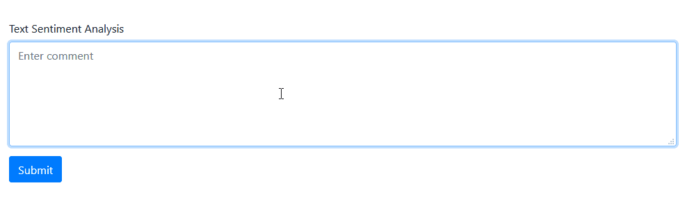

# Aggressive Comments Analyzer
React and Node JS application using the google natural language api to detect offensive or agresive comments. Pretty useful to analyze social media sentiment on a topic or warn your users about offensive comments.

## Getting Started

1. Clone the project.
2. Npm install in both front and back folders.
3. Inside sentiment-api-back/enviroment fill gcloud-private-key.json file with your [Google Cloud Sentiment API credentials](https://cloud.google.com/natural-language/docs/sentiment-tutorial?hl=es-419).

## Running the app

1. Inside sentiment-api-front folder run _npm start_ command.
2. Indise sentiment-api-back folder run _npm run dev_ command.

## Built With

* [NodeJs](https://nodejs.org/) -  JavaScript runtime built on Chrome's V8 JavaScript engine.
* [Express](https://expressjs.com/) - Fast, unopinionated, minimalist web framework for Node.js
* [React](https://reactjs.org/) - A JavaScript library for building user interfaces
* [Google Sentiment API](https://cloud.google.com/natural-language) - Derive insights from unstructured text using Google machine learning
* [Axios](https://github.com/axios/axios) - Promise based HTTP client for the browser and node.js

## Authors

* **Luis Barral** - *All work* - [Barralex](https://github.com/Barralex)

## License

This project is licensed under the MIT License
